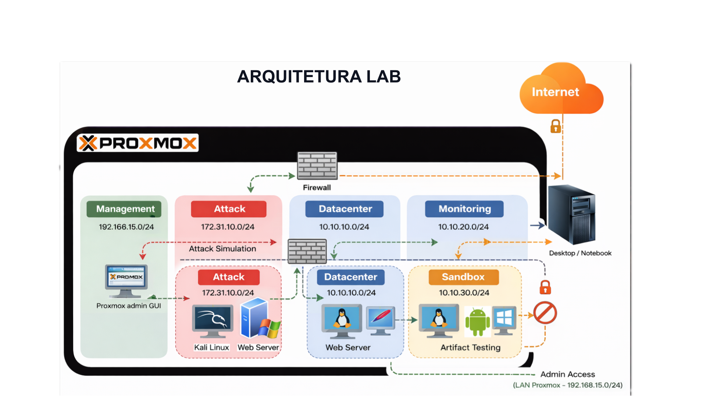

# 🔐 Cybersecurity Home Lab Pro

Repositório dedicado à documentação, implementação e evolução do meu laboratório do curso prático baseado **Cybersecurity Home Lab Pro**.

---

## 🎯 Objetivo

Construir um ambiente completo de laboratório para:

- 🔍 Detecção e Resposta a Incidentes (SOC)
- 🧪 Análise de Malware
- 📊 SIEM e Threat Hunting
- 🛡️ Hardening e Monitoramento
- 🤖 Automação de Segurança
- 🧠 Simulação de ataques (Red Team) e detecção (Blue Team)

---

## 🏗️ Arquitetura do Laboratório

### 🔹 Hypervisor
- Proxmox VE

### 🔹 Monitoramento / SIEM
- Wazuh
- Zabbix

### 🔹 Análise de Malware
- REMnux

### 🔹 Ambiente Active Directory
- Windows Server (Domain Controller)
- Active Directory
- Windows 11 (Máquina cliente)

---

